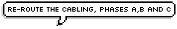
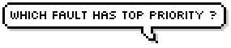
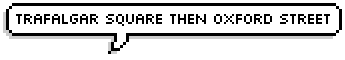
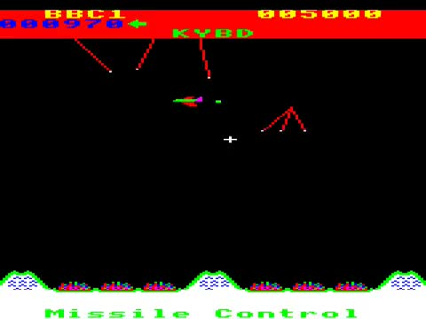

:title: Delegation! 
:data-transition-duration: 1500
:css: delegation.css

Tools used,
http://wigflip.com/ds/
https://www.google.co.uk/imgres?imgurl=http%3A%2F%2Fwww.reidlitchfield.com%2Fwp-content%2Fuploads%2F2015%2F07%2Fsuperman-1.jpg&imgrefurl=https%3A%2F%2Fwww.reddit.com%2Fr%2Frespectthreads%2Fcomments%2F3ovxvl%2Frespect_superman_complete_postcrisis%2F&docid=yVFTE8LlXyUGgM&tbnid=_4GZinGYWldMxM%3A&w=800&h=600&hl=en-gb&client=browser-ubuntu&bih=805&biw=1600&ved=0ahUKEwjErIvEn_vPAhUIBcAKHbnOB6U4ZBAzCBMoETAR&iact=mrc&uact=8

rm Missile1.mp4 ; ffmpeg -i ./BBC\ Micro\ game\ Missile\ Control-VrVOwaztcTk.webm -ss 51.5 -t 10.1 Missile1.mp4 ; rm crop_missile.mp4 ; ffmpeg -i Missile1.mp4 -filter:v "crop=180:200:145:150" crop_missile.mp4 ; rm scale_Milssile.mp4 ; ffmpeg -i crop_missile.mp4 -vf scale=360:-1 scale_Milssile.mp4

----

:data-rotate-y: 90

Delegation Masterclass
======================

It is not for the *Lazy!*
---------------------------------

.. note::

    Talk about my previous method of management

    Why delegation is key

    Why delegation is not the lazy option (opposite!)

----

:data-x: r0
:data-y: r600
:data-z: r-100
:data-rotate-y: 0
:data-rotate-x: 90

----

:data-x: r0
:data-y: r100
:data-z: r0
:data-rotate-x: r-45

----

:data-y: r100
:data-rotate-x: r-45

----

:data-x: r0
:data-y: r100
:data-z: r200
:data-scale: 0.01
:data-rotate-x: 0

.. image:: images/superman-1.jpg

.. note::

    Notice the red tie, blue suit, great jaw line ...
    
    Great for my ego, great for build a team ?

----

:data-x: r6
:data-y: r0
:data-z: r5
:data-scale: 0.01

Holidays

----

:data-x: r-12
:data-y: r0
:data-z: r0
:data-scale: 0.01

Workload

----

:data-x: r6
:data-y: r5
:data-z: r0
:data-scale: 0.01

Succession Planning

----

:data-x: r0
:data-y: r-15
:data-z: r0
:data-scale: 0.05

:id: dang

Still Superman ?

.. note::

    I am still doing a super job with all these gaps ?
    
    What about looking up and new threats ?

----

:data-scale: 1
:data-y: r800
:data-x: r0

.. image:: images/Window-Missile-Control.jpg

----

:data-scale: 1
:data-y: r800
:data-x: r0

----

:data-y: r-2200
:data-x: r1600
:data-scale: 1

Delegation
==========

* What to delegate
* How
* Benefits

.. note::

    Now we know Why - lets look at the what
    
    Main part of this Masterclass is three areas

----

:data-x: r0
:data-y: r800

What to Delegate
================

* Interesting  
* Development
* Where the context is known

.. note::

    Golden rules

    Got to be of interest to the person your delegating to

    Should develop the person 

    Must be where the context is known 

----

:id: danger

Danger
==========

* No context  
* Answer you can not live with
* Not interesting or boring

.. note::

    If people don’t have the right context, they may make the 'wrong' answer. Context: Reduce costs, but this may end-up minimise 'Engineering' or 'Procurement' costs as the detrement to the wider project costs.

    You delegate Authority, but keep responsibility

    So you have to live with the decision.

    You be accused of being lazy if it is boring, (person not motivated)

----

:data-x: 0
:data-y: 50
:data-z: -200
:data-rotate-y: 90
:data-scale: 0.2

----

:data-x: 2600
:data-y: 2200
:data-z: r0
:data-rotate-y: 0
:data-rotate-z: -30
:data-scale: 1

Context
==========

* Does the person know ?  
* How, preparation ?
* Strategy, intent - not how

.. note::

    Communication, Communication, Communication.

    What are we trying to achieve ? [Our design easier to build]  Great leaders bang on about what they are trying to achieve.

    Need to have done the preparation before hand. [Explain or demo how building is hard]

    IMPORTANT You not communicating how to do it or even what to do but your intent. IMPORTANT

    e.g. Reduce cost of installation of on site, out design easier to build
    
    I may think that symmetrical, reduce part count. But again, need to keep space for whole of team to think - for the best diverse range of solutions. 
    

----

:data-x: r0
:data-y: r800
:data-z: r0
:data-rotate-z: 0

Live with it
============

* Think of all the outcomes
* Trust the delegated person  
* Roll with it

.. note::

    If you have the _Intent_ correct; then this should not be a problem. 
    
    The how may be different or novel, but who care - intent is correct

----

:data-x: r0
:data-y: r800
:data-z: r0
:data-rotate-z: 30

Avoid Boring
============

* Not the rubbish
* Might have to sell it
* Communication is key

.. note::

    Last What: 
    Reason for delegating something should not be it is boring.

----

:data-x: r-1100
:data-y: r400
:data-z: r0
:data-rotate-y: 0
:data-rotate-z: 0
:data-scale: 1

Mistaken Dangers
================

* Too difficult
* Not authorised
* Not competent

.. note::

    Couple of thing that DO NOT Stop you, 

    Too difficult; Good -> Interesting, Development

    You resposible, so it up to you if you want to deligate. You are passing your Authority (but not responsibility) to them

    You never going to grow people if you assume not competent

----

:data-x: r800
:data-rotate-y: 0
:data-rotate-z: 30
:data-scale: 1

Too difficult
================

* Only Superman is competent ?
* Build another Superman
* Avengers Assemble!

----

:data-x: r1600
:data-y: r-4000
:data-rotate-y: 0
:data-rotate-z: 0
:data-scale: 1

How
===

* Delegate upwards
* Do, Check, Go
* Do, Inform, Go
* Just Do it

.. note::

    Maymoon - ignore that comment! 
    
    Three stages - progress over time. 
    
    Start with least risky, - Do, Check, Go

----

:data-x: r0
:data-y: r800
:data-rotate-y: 0
:data-rotate-z: 0
:data-scale: 1

Do, Check, Go
=============

* Complex
* Builds confidence
* Still authorising 

.. note::

    Not make it do, re-do, go

    Confidence is both ways
    
    Clear communication

----

Do, Inform, Go
==============

* Less complex
* Giving authority
* Still responsible

.. note::

    Less complex or have already build confidence

----

Just Do it
==============

* Giving authority
* Still responsible
* Builds trust, if not seen as lazy

.. note::

    At the heart of Just Do it is...

----

:data-x: r115
:data-y: r-280
:data-z: r10
:data-rotate-y: 0
:data-rotate-z: 0
:data-scale: 0.01

----

:data-x: r-115
:data-y: r1080
:data-z: r-10
:data-scale: 1

Pass the Parcel
===============

* One to One
* At a meeting
* Avoid the one line email!

----

:data-x: r0
:data-y: r800
:data-z: r0
:data-scale: 1

Pass the Parcel
===============

.. note::

    Ender's Games - (great sci-fi book, one of the best Book on Leadership, butchered by the film)

    Build confidences

    Build respect
    
    Build diverse range of input (remember what not the how)
    
    All else fails, you can suggest another how "Have you considered X ?"

----

:data-x: r800
:data-y: r-2400

Benefits
===============

* Value your team or peers
* New Super-people
* Able to keep look at - wider view

.. note::

    Value - remember not LAZY
    
    Widerview - missle control!

----

:data-x: r1600
:data-y: r-0

Information
===============

* https://bmsleight.github.io/delegation-presentation/
* Source code: https://raw.githubusercontent.com/bmsleight/delegation-presentation/master/delegation.rst

.. note::

    Code

----

:data-x: 2000
:data-y: 2000
:data-scale: 7.5
:data-rotate-z: 0
:data-rotate-x: 0
:data-rotate-y: 0
:data-z: 0
